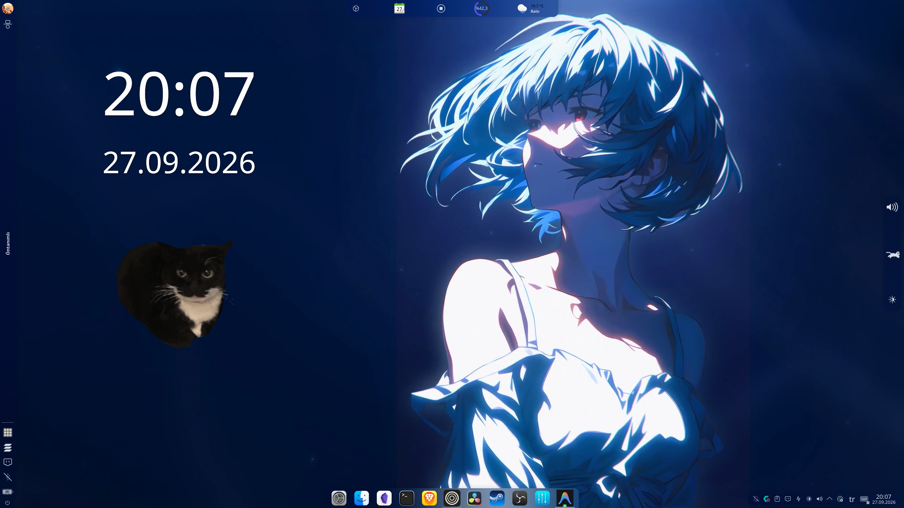

# 🌌 KDE 6 "Hyprland Style" Sleek Rice & Dotfiles

> **Minimalist, modern, Hyprland esintili döşemeli (tiling) ve animasyonlu KDE Plasma 6 masaüstü özelleştirmesi.**
---

## 📺 YouTube Video Rehberi & Önizleme

[](https://youtu.be/eOziGJlgniM)
[](https://www.youtube.com/@Aethelis)
[](https://github.com/aethelisdev/kde6hyprland/stargazers)

[](https://youtu.be/eOziGJlgniM)

> 📹 **Video Rehberi:** Kurulum adımları ve masaüstü incelemesi için videoyu izleyin: [youtu.be/eOziGJlgniM](https://youtu.be/eOziGJlgniM)

---

## ✨ Özellikler

* **Hyprland Tiling Hissi:** KDE 6'nın dahili pencere döşeme (Tiling) kuralları ve boşlukları (gaps) ile pencereler otomatik düzenlenir.
* **Çoklu Panel Düzeni:**
  * **Üst Bar:** Minimal Chaac hava durumu, medya kontrolleri, bellek kullanım göstergesi ve Plasma Control Hub.
  * **Sol Bar:** Uygulama başlatıcı (`org.linexin.launcher`), pencere başlığı (`org.kde.windowtitle.Fork`), etkinlik yöneticisi ve hızlı çıkış menüsü.
  * **Sağ Bar:** Ses, parlaklık ve interaktif **Catwalk** (klavye/fare hızına göre koşan kedi) animasyonu.
  * **Alt Dock:** Şık, ortalanmış macOS/Hyprland tarzı ikon görev çubuğu (`icontasks`).
* **Özel Masaüstü Widget'ları:** Masaüstünde **Maxwell the Cat** ve şık dijital saat.
* **Canlı / Video Duvar Kağıdı:** Smart Video Wallpaper Reborn eklentisi ve anime temalı canlı arka plan.
* **Tema & İkonlar:**
  * **Pencere Dekorasyonu:** Sweet-Dark (Aurorae)
  * **Renk Şeması:** SweetAmbarBlue
  * **İkon Paketi:** BigSur-black-dark
  * **Plasma Teması:** Iridescent-round / Sweet

---

## 🚀 Hızlı Kurulum (Tek Komutla)

Terminalinizi açın ve aşağıdaki komutu yapıştırın:

```bash
git clone https://github.com/aethelisdev/kde6hyprland.git && cd kde6hyprland && chmod +x install.sh && ./install.sh
```

> **Not:** Kurulum başlamadan önce mevcut masaüstü ayarlarınız otomatik olarak `~/.kde6_rice_backup_[tarih]` klasörüne **tamamen yedeklenir**. Hiçbir veriniz kaybolmaz.

---

## 🔄 Eski Ayarlara Nasıl Geri Dönerim?

Eğer eski KDE görünümünüze dönmek isterseniz repodaki geri yükleme betiğini çalıştırmanız yeterlidir:

```bash
cd kde6hyprland
chmod +x restore.sh
./restore.sh
```

---

## 📦 Paket İçeriği

```text
kde6hyprland/
├── install.sh              # Otomatik kurulum ve akıllı yapılandırma betiği
├── restore.sh              # Eski ayarlara tek tıkla geri dönme aracı
├── config/                 # Temizlenmiş ve dinamik hale getirilmiş KDE 6 ayarları
│   ├── plasma-org.kde.plasma.desktop-appletsrc
│   ├── kdeglobals
│   ├── kwinrc
│   ├── plasmarc
│   ├── kglobalshortcutsrc
│   └── alacritty.toml
├── plasmoids/              # Özel KDE eklentileri (Catwalk, Control Hub, Chaac, vb.)
├── themes/                 # Sweet-Dark dekorasyonları, renk şemaları ve BigSur ikonları
├── wallpapers/             # Canlı video duvar kağıdı ve statik yüksek çözünürlüklü arka plan
└── wallpaper-plugin/       # Smart Video Wallpaper Reborn eklentisi
```

---

## ⌨️ Önemli Kısayollar

* `Meta (Süper / Windows tuşu)`: Modern Uygulama Başlatıcı (`Linexin Launcher`)
* `Alt + T`: Terminali Aç (`Konsole`)
* `Alt + A`: Sistem Ayarlarını Aç (`System Settings`)
* `Meta + Z`: Tarayıcıyı Başlat (`Zen Browser`)
* `Meta + A`: Sonraki Etkinliğe Geç (Activities)
* `Meta + Q`: Etkinlik Değiştirici Menüsü
* `Meta + V`: Pano (Clipboard) Geçmişi
* `Meta + W`: Genel Bakış (Overview)
* `Meta + T`: Döşeme (Tiling) Düzenleyicisi

---

## 👤 Geliştirici & İletişim

* **YouTube:** [@Aethelis](https://www.youtube.com/@Aethelis)
* **GitHub:** [@aethelisdev](https://github.com/aethelisdev)
* Videoyu beğendiyseniz repoya yıldız (⭐️) vermeyi ve kanala abone olmayı unutmayın!
